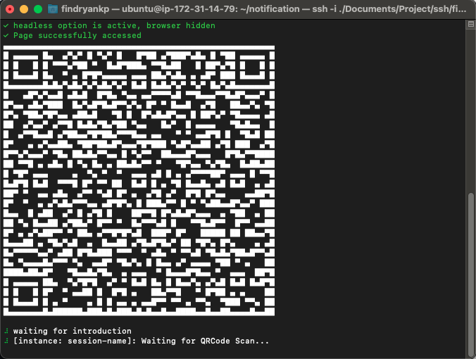
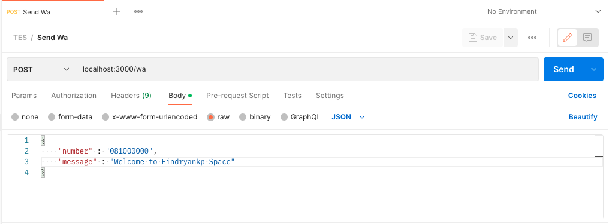

# WA Notification With NodeJs (Venom Bot)

## 💫 About
Sending automated WhatsApp notifications using NodeJs (Venom Bot).

## 🚀 Clone Repo
```shell
git clone https://github.com/Findryankp/notification.git
```

## 👨🏽‍💻 Step By Step
1. Install latest node JS version
2. Install latest `npm` version
3. Install All packages needed
```shell
npm install
```
4. Install Chroimium Browser (if you use terminal server)
```shell
sudo apt-get install chromium-browser
```

## 🎯 Run Project
```shell
sudo node main.js
```

* Scan Barcode with your whatapp app
<div align="center">
  <a href="images/2.png">
    
  </a>
</div>

* Try with your postman
<div align="center">
  <a href="images/1.png">
    
  </a>
</div>


## 😎 Development by
[](https://github.com/Findryankp)
[](https://www.linkedin.com/in/Findryankp/)